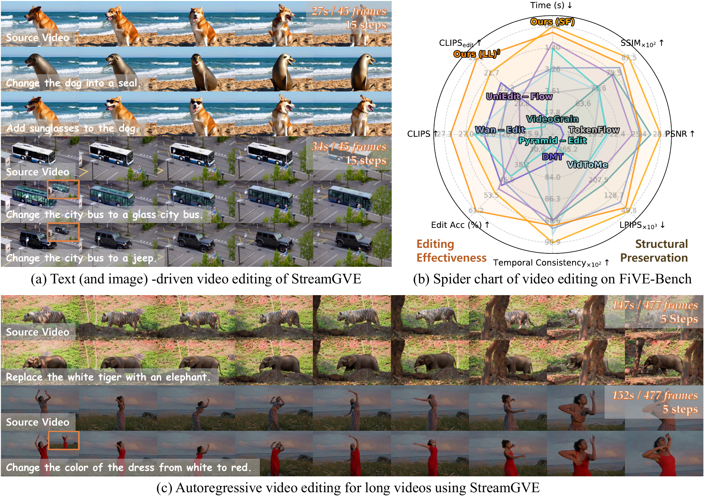
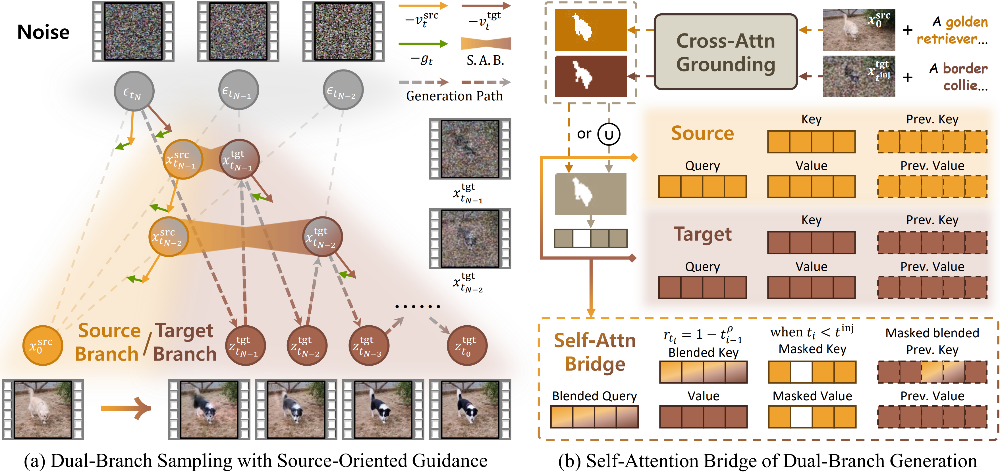

# StreamGVE: Training-Free Video Editing via Few-Step Streaming Video Generation

[Guanlong Jiao](https://scholar.google.com/citations?user=UCPOxvEAAAAJ&hl=en)<sup>1,4</sup>, [Chenyangguang Zhang](https://zhangcyg.github.io/)<sup>2</sup>, [Jia Jun Cheng Xian](https://www.linkedin.com/in/jia-jun-cheng-xian-56b00a208/)<sup>1,4</sup>, [Zewei Zhang](https://scholar.google.com/citations?user=RWGzBeoAAAAJ&hl=en)<sup>1,3</sup>, [Renjie Liao](https://lrjconan.github.io/)<sup>1,4,5</sup>

<sup>1</sup>The University of British Columbia, <sup>2</sup>ETH Zürich, <sup>3</sup>McMaster University, <sup>4</sup>Vector Institute, <sup>5</sup>Canada CIFAR AI Chair

[]()
[](https://github.com/DSL-Lab/StreamGVE/)
[](https://dsl-lab.github.io/StreamGVE/)

VIdeo Results are all shown in our [*Project Page*](https://dsl-lab.github.io/StreamGVE/).

---

<p align="center">
  
</p>

## ✨ Highlights

StreamGVE is a training-free video editing framework built on few-step streaming video generation models. Instead of treating editing as data-to-data transformation, StreamGVE formulates editing as source-conditioned noise-to-target generation, thus makeing it possible for few-step fast controllable video editing. StreamGVE supports **few-step text-driven video editing** and **optional first-frame visual prompting** for **videos of any length**. It is implemented on streaming video generation models:

- [`Self-Forcing_StreamGVE`](./Self-Forcing_StreamGVE/README.md): StreamGVE built on [Self Forcing](https://github.com/guandeh17/Self-Forcing).
- [`LongLive_StreamGVE`](./LongLive_StreamGVE/README.md): StreamGVE built on [LongLive v1.0](https://github.com/NVlabs/LongLive/tree/v1.0).

<p align="center">
  
</p>


## 🏡 Environment

```bash
conda create -n streamgve python=3.12 -y
conda activate streamgve

# Choose the PyTorch command appropriate for your CUDA version, example for CUDA 12.8:
pip install torch==2.8.0 torchvision==0.23.0 --index-url https://download.pytorch.org/whl/cu128

pip install -r requirements.txt
pip install flash-attn --no-build-isolation
```

For the Self Forcing-based implementation, install the local package in editable mode:

```bash
cd Self-Forcing_StreamGVE
python setup.py develop
cd ..
```

## 🎯 Checkpoints

### Self Forcing

```bash
cd Self-Forcing_StreamGVE
huggingface-cli download Wan-AI/Wan2.1-T2V-1.3B --local-dir-use-symlinks False --local-dir wan_models/Wan2.1-T2V-1.3B
huggingface-cli download gdhe17/Self-Forcing checkpoints/self_forcing_dmd.pt --local-dir .
cd ..
```

### LongLive

```bash
cd LongLive_StreamGVE
huggingface-cli download Wan-AI/Wan2.1-T2V-1.3B --local-dir wan_models/Wan2.1-T2V-1.3B
huggingface-cli download Efficient-Large-Model/LongLive --local-dir longlive_models
cd ..
```

You can share the checkpoints of Wan through soft links, as they are the same across projects.

## 🎨 Running Video Editing

Each implementation provides a ready-to-run example script.

### Self Forcing-based editing

```bash
cd Self-Forcing_StreamGVE
bash inference_edit_streamgve.sh
```

### LongLive-based editing

```bash
cd LongLive_StreamGVE
bash inference_edit_streamgve.sh
```


## 🎉 Acknowledgements

This repository builds on the excellent open-source work of [Self Forcing](https://github.com/guandeh17/Self-Forcing), [LongLive](https://github.com/NVlabs/LongLive), and [Wan2.1](https://github.com/Wan-Video/Wan2.1). We also thank [UniEdit-Flow](https://github.com/DSL-Lab/UniEdit-Flow) and [FiVE-Bench](https://github.com/MinghanLi/FiVE-Bench) for helpful open-soucre code and benchmarks.

## 🔮 Citation

If you find this work useful, please consider citing:

```bibtex
TODO
```
